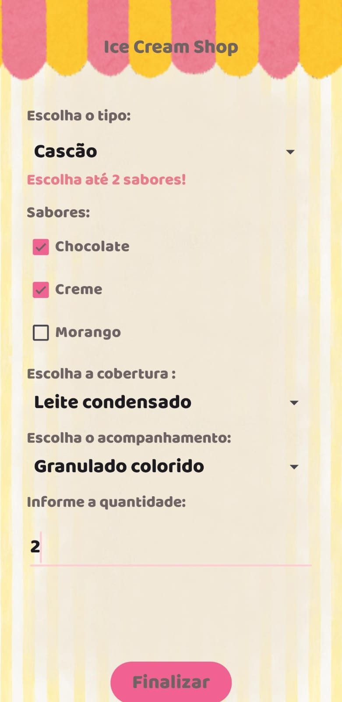
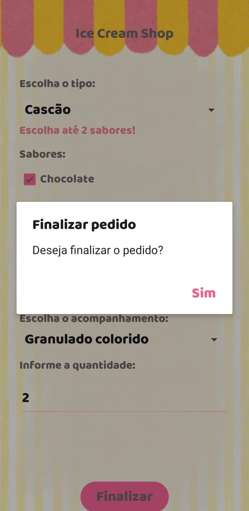
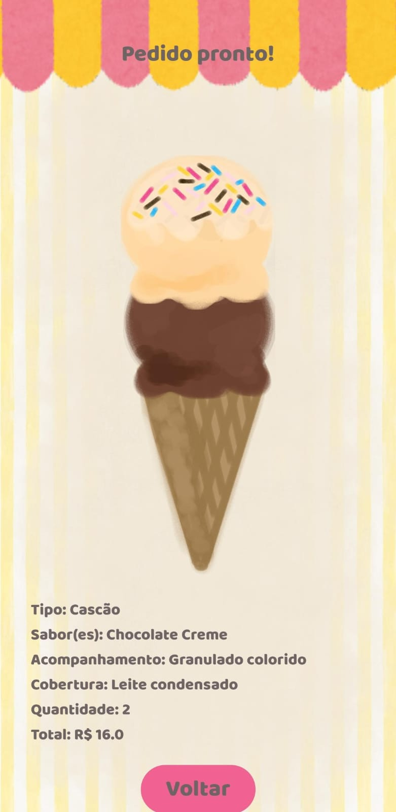

# 🍦 Ice Cream Shop

Aplicativo Android desenvolvido em **Java** para simular a realização de pedidos em uma sorveteria.

O usuário pode escolher o tipo de sorvete, sabores, cobertura, acompanhamento e quantidade. Após finalizar o pedido, o aplicativo apresenta um resumo com as escolhas realizadas, o valor total e uma representação visual do sorvete montado.

## 📱 Funcionalidades

* Escolha entre **Casquinha** e **Cascão**.
* Seleção de sabores:

  * Chocolate
  * Creme
  * Morango
* Escolha de cobertura:

  * Nenhuma
  * Chocolate
  * Leite condensado
  * Morango
* Escolha de acompanhamento:

  * Nenhum
  * Cereja
  * Granulado de chocolate
  * Granulado colorido
* Definição da quantidade.
* Validação das opções selecionadas.
* Confirmação antes de finalizar o pedido.
* Exibição do resumo do pedido.
* Cálculo do valor total.
* Montagem visual do sorvete de acordo com as escolhas do usuário.

## 🍨 Regras dos sabores

A quantidade máxima de sabores depende do tipo escolhido:

| Tipo      | Máximo de sabores |
| --------- | ----------------: |
| Casquinha |                 1 |
| Cascão    |                 2 |

O aplicativo também exige que pelo menos um sabor seja selecionado antes da finalização.

## 💰 Valores

| Produto   |   Valor |
| --------- | ------: |
| Casquinha | R$ 5,00 |
| Cascão    | R$ 8,00 |

O valor total é calculado de acordo com o tipo escolhido e a quantidade informada.

## 🖼️ Telas

### Tela de pedido

Nesta tela o usuário configura seu sorvete escolhendo tipo, sabores, cobertura, acompanhamento e quantidade.





### Tela de pedido finalizado

Após a confirmação, o aplicativo apresenta o sorvete montado e as informações do pedido.



## 🛠️ Tecnologias utilizadas

* Java
* Android Studio
* Android SDK
* XML
* AndroidX
* ConstraintLayout
* LinearLayout
* FrameLayout

## 📂 Estrutura principal

```text
app/
├── src/
│   └── main/
│       ├── java/
│       │   └── com/unir/icecreamshop/
│       │       ├── MainActivity.java
│       │       └── OrderActivity.java
│       │
│       ├── res/
│       │   ├── layout/
│       │   │   ├── activity_main.xml
│       │   │   └── activity_order.xml
│       │   │
│       │   └── drawable/
│       │       └── imagens utilizadas na montagem do sorvete
│       │
│       └── AndroidManifest.xml
│
└── build.gradle
```

## ⚙️ Funcionamento

### `MainActivity`

A `MainActivity` é responsável pela montagem do pedido.

Ela recebe as escolhas feitas pelo usuário e realiza validações antes de permitir a finalização.

Entre as validações estão:

* Quantidade obrigatória.
* Pelo menos um sabor selecionado.
* Máximo de 1 sabor para casquinha.
* Máximo de 2 sabores para cascão.

Ao finalizar, os dados são enviados para a `OrderActivity` utilizando uma `Intent`.

### `OrderActivity`

A `OrderActivity` recebe as informações do pedido e:

1. Identifica o tipo escolhido.
2. Calcula o valor do pedido.
3. Exibe os sabores selecionados.
4. Exibe cobertura e acompanhamento.
5. Exibe a quantidade.
6. Apresenta o valor total.
7. Monta visualmente o sorvete utilizando imagens sobrepostas.

## ▶️ Como executar

1. Clone ou baixe este repositório.
2. Abra o projeto no **Android Studio**.
3. Aguarde a sincronização do Gradle.
4. Selecione um dispositivo Android ou emulador.
5. Clique em **Run ▶**.
6. O aplicativo será compilado e instalado no dispositivo selecionado.

### By Camila Fernanda

> Projeto desenvolvido como aplicação Android para prática de desenvolvimento mobile utilizando Java e XML.